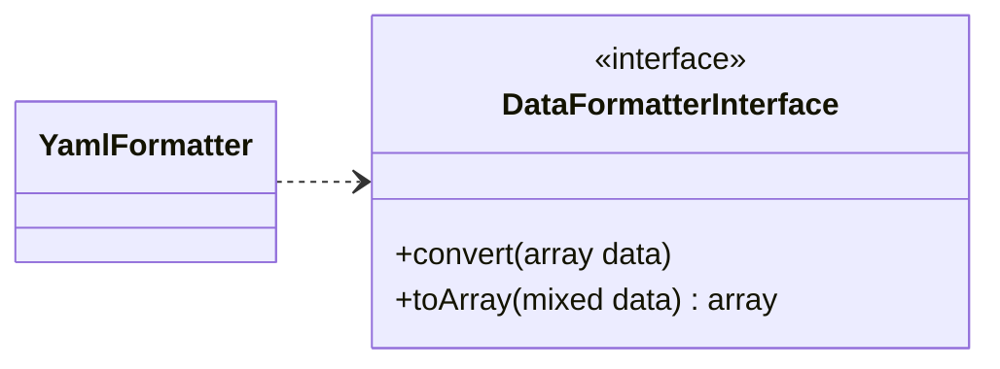

# Adding a parser

In this part we will see together how to create a parser that we will add to the list of parsers that are already present. And we will create a parser that will be in charge of parsing **YAML**.

!!! info "Information"
    In order to be able to follow this part, we recommend that you familiarize yourself with the [structure](/structure/) of the bookstore if you have not already done so.

## Step 1: Creation of the class

### Class diagram



As you can see above, all parsers must implement the DataFormatterInterface! Therefore we will have to implement both methods of the interface.

### Basic structure

We will create a file _**YamlFormatter.php**_ that we will save in the folder _(project_location)/DataParser/DataFormatters/_. This file will contain the source code of our new parser.<br/>
And here is, below, the minimal code of our parser _YAML_.

```php linenums="1" title="YamlFormatter.php (minimal code)"
declare(strict_types=1);

namespace DataParser\DataFormatters;

use DataParser\DataFormatterInterface;

class YamlFormatter implements DataFormatterInterface {
  public function convert(array $data) : mixed {
    return '';
  }
  public function toArray(mixed $data) : array {
    return [];
  }
}
```

### Implementation of the methods

To parse data in _array_, PHP has a _**yaml_parse()**_ function. So we will use this method in our _**toArray()**_ method by passing the data to be parsed to it and that we will retract the result.

```php linenums="1" title="toArray()"
public function toArray(mixed $data) : array {
  return yaml_parse($data);
}
```

And to parse data from _array_ to _yaml_ format, PHP has a _**yaml_emit()**_ function. So we will use this method in our _**convert()**_ method by passing it the _array_ to parse and we will retract the result.

```php linenums="1" title="convert()"
public function convert(array $data) : mixed {
  return yaml_emit($data);
}
```

And here is the final class:

```php linenums="1" title="YamlFormatter.php (final code)"
declare(strict_types=1);

namespace DataParser\DataFormatters;

use DataParser\DataFormatterInterface;

class YamlFormatter implements DataFormatterInterface {
  public function convert(array $data) : mixed {
    return yaml_emit($data);
  }
  public function toArray(mixed $data) : array {
    return yaml_parse($data);
  }
}
```

## Step 2: Configuration of the class

In this section we will see together how to add the class we created above so that it can be used.<br/>
To do this, nothing could be simpler, in the folder _(project_location)/DataParser_ we will add our class as a parser in the file _**DataFormat.php**_ as illustrated in the source code below:

```php linenums="1" title="YamlFormatter.php (final code)"
declare(strict_types=1);

namespace DataParser;

use \DataParser\DataFormatters\{
  ArrayFormatter,
  JsonFormatter,
  DtoFormatter,
  XmlFormatter,
  YamlFormatter // namesapce of our parser
};

enum DataFormat: string {
  case ARRAY_FORMAT = ArrayFormatter::class;
  case JSON_FORMAT = JsonFormatter::class;
  case DTO_FORMAT = DtoFormatter::class;
  case XML_FORMAT = XmlFormatter::class;
  case YAML_FORMAT = YamlFormatter::class; // the name of our class
}
```

Now that our parser is set up, we can move on to using it in the next chapter.

## Usage

To test the correct operation of our parser we will try to parse an _array_ into _YAML_. Let's write the following code:

```php linenums="1" title="YamlFormatter.php (minimal code)"
// autoloading...

$data = [
  "given" => "Chris",
  "family"=> "Dumars",
  "address"=> [
    "lines"=> "458 Walkman Dr. Suite #292",
    "city"=> "Royal Oak",
    "state"=> "MI",
    "postal"=> 48046,
  ],
];

$parser = new DataParser($data, DataFormat::ARRAY_FORMAT);
$result = $parser->convertTo(DataFormat::YAML_FORMAT);

print_r($result);
```

And here is the result:

```yml
given: "Chris"
  family: "Dumars"
  address:
    lines: "458 Walkman Dr. Suite #292"
    city: "Royal Oak"
    state: "MI"
    postal: 48046
```

Normally, if you have followed all the steps correctly, you should get the same result as above.

## Conclusion

Now you know how to add a parser to the PHP Data Parser library.