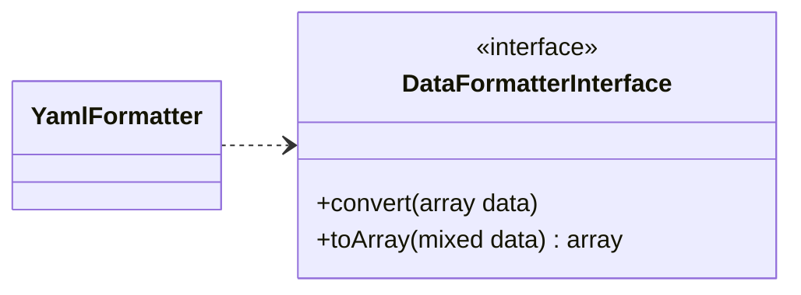

# Ajout d'un parser

Dans cette partie nous allons ensemble voir comment créer un parser que nous allons ajouter à la liste des parsers qui sont déjà présents. Et nous allons créer un parser qui sera chargé de parser du **YAML**.

!!! info "Information"
    Pour pouvoir suivre cette partie, nous vous récommandons si ce n'est pas encore fait de vous familiariser avec la [structure](/fr/structure/) de la libraire.

## Etape 1 : Création de la classe

### Diagramme de classe


Comme vous pouvez le voir ci-dessus, tous les parsers doivent implémenter l'interface DataFormatterInterface ! Par conséquent nous aurons à implémenter les deux méthodes de l'interface.

### Structure de base
Nous allons créer un fichier _**YamlFormatter.php**_ que nous allons enrégistrer dans le dossier _(project_location)/DataParser/DataFormatters/_. Ce fichier contiendra le code source de notre nouveau parser.<br/>
Et voici, ci-dessous, le code minimal de notre parseur _YAML_.


```php linenums="1" title="YamlFormatter.php (code minimal)"
declare(strict_types=1);

namespace DataParser\DataFormatters;

use DataParser\DataFormatterInterface;

class YamlFormatter implements DataFormatterInterface {
  public function convert(array $data) : mixed {
    return '';
  }
  public function toArray(mixed $data) : array {
    return [];
  }
}
```

### Implémentation des méthodes

Pour parser des données en _array_, PHP possède une fonction _**yaml_parse()**_. Nous allons donc utiliser cette méthode dans notre méthode _**toArray()**_ en lui passant la donnée à parser et que nous allons rétrouner le résultat.

```php linenums="1" title="toArray()"
public function toArray(mixed $data) : array {
  return yaml_parse($data);
}
```

Et pour parser des données de _array_ vers le format _yaml_, PHP possède une fonction _**yaml_emit()**_. Nous allons donc utiliser cette méthode dans notre méthode _**convert()**_ en lui passant le _array_ à parser et que nous allons rétrouner le résultat.

```php linenums="1" title="convert()"
public function convert(array $data) : mixed {
  return yaml_emit($data);
}
```

Et voici la classe finale :

```php linenums="1" title="YamlFormatter.php (code final)"
declare(strict_types=1);

namespace DataParser\DataFormatters;

use DataParser\DataFormatterInterface;

class YamlFormatter implements DataFormatterInterface {
  public function convert(array $data) : mixed {
    return yaml_emit($data);
  }
  public function toArray(mixed $data) : array {
    return yaml_parse($data);
  }
}
```

## Etape 2 : Configuration de la classe

Dans cette section nous voir ensemble comment ajouter la classe que nous avons créé ci-dessus afin qu'elle soit utilisable.<br/>
Pour ce faire, rien de plus simple, dans le dossier _(project_location)/DataParser_ nous allons ajouter notre classe comme un parseur dans le fichier _**DataFormat.php**_ comme illustré dans le code source ci-dessous :

```php linenums="1" title="YamlFormatter.php (code final)"
declare(strict_types=1);

namespace DataParser;

use \DataParser\DataFormatters\{
  ArrayFormatter,
  JsonFormatter,
  DtoFormatter,
  XmlFormatter,
  YamlFormatter // namesapce de notre parseur
};

enum DataFormat: string {
  case ARRAY_FORMAT = ArrayFormatter::class;
  case JSON_FORMAT = JsonFormatter::class;
  case DTO_FORMAT = DtoFormatter::class;
  case XML_FORMAT = XmlFormatter::class;
  case YAML_FORMAT = YamlFormatter::class; // le nom de notre classe
}
```

Maintenant que notre parser est enrégistré, nous pouvons passer à son utilisation au chapitre suivant.

## Utilisation

Pour tester le bon fonctionnement de notre parser nous allons tenter de parser un _array_ en _YAML_. Ecrivons le code suivant :

```php linenums="1" title="YamlFormatter.php (code minimal)"
// autoloading...

$data = [
  "given" => "Chris",
  "family"=> "Dumars",
  "address"=> [
    "lines"=> "458 Walkman Dr. Suite #292",
    "city"=> "Royal Oak",
    "state"=> "MI",
    "postal"=> 48046,
  ],
];

$parser = new DataParser($data, DataFormat::ARRAY_FORMAT);
$result = $parser->convertTo(DataFormat::YAML_FORMAT);

print_r($result);
```

Et voici le résultat obtenu :
```yml
given: "Chris"
  family: "Dumars"
  address:
    lines: "458 Walkman Dr. Suite #292"
    city: "Royal Oak"
    state: "MI"
    postal: 48046
```

Normalement, si vous avez bien suivi toutes les étapes, vous devrez obtenir le même résultat que ci-dessus.

## Conclusion

Maintenant vous savez comment ajouter un parser dans la librairie PHP Data Parser.