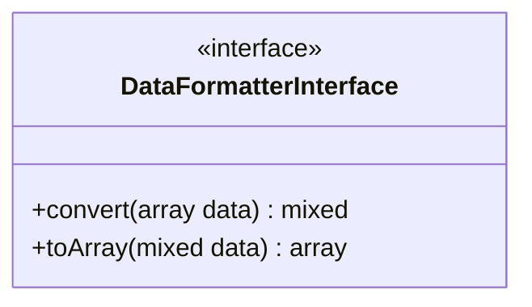

# DataFormatterInterface

## UML Diagram



## Source code

```php  linenums="1" title="DataFormatterInterface.php"
declare(strict_types=1);

namespace DataParser;

interface DataFormatterInterface {
	
	/**
	 * Convert from array to implemented data format
	 * @param  array  $data
	 * @return mixed
	 */
	public function convert(array $data) : mixed;

	/**
	 * Convert data to array
	 * @param  mixed $data
	 * @return array
	 */
	public function toArray(mixed $data) : array;
}
```