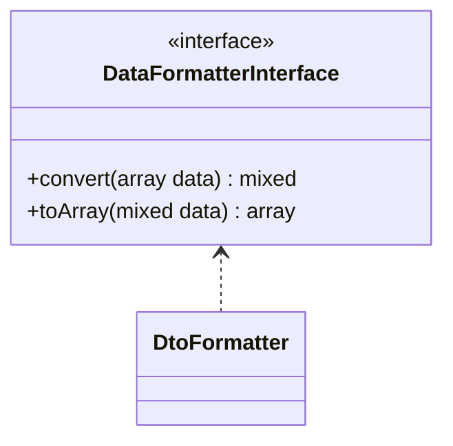

# DtoFormatter

## Diagramme UML



## Code source

```php  linenums="1" title="DtoFormatter.php"
declare(strict_types=1);

namespace DataParser\DataFormatters;

use DataParser\DataFormatterInterface;

class DtoFormatter implements DataFormatterInterface {
	/**
	 * Parse data from array to stdClass
	 * @param  array  $data
	 * @return mixed
	 */
	public function convert(array $data) : mixed {
		return json_decode(json_encode($data));
	}
	/**
	 * Parse data from stdClass to array
	 * @param  mixed $data
	 * @return array
	 */
	public function toArray(mixed $data) : array {
		return json_decode(json_encode($data), true);
	}
}
```