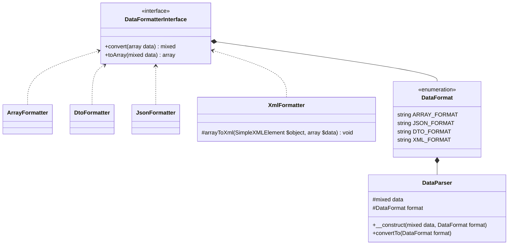
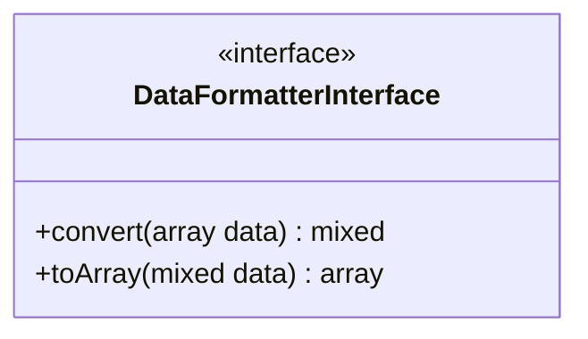
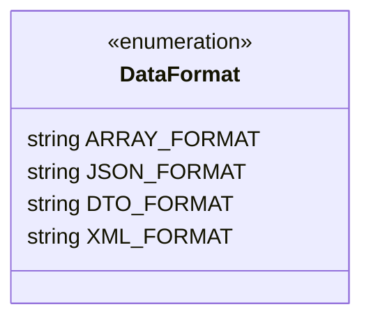
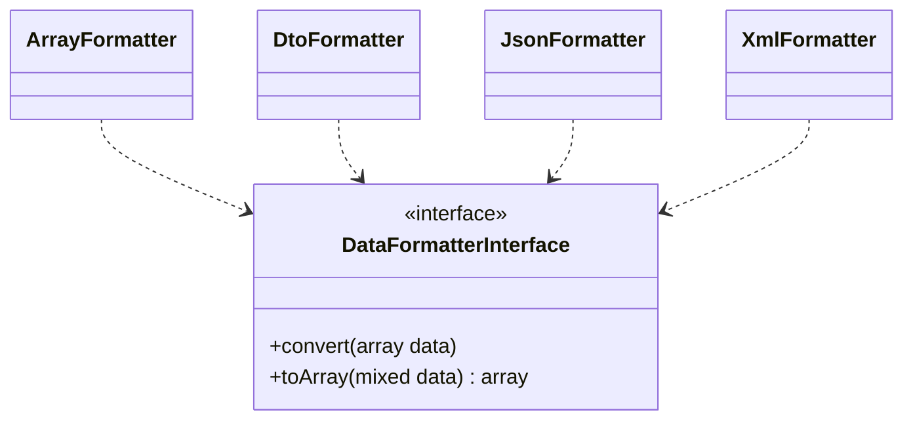
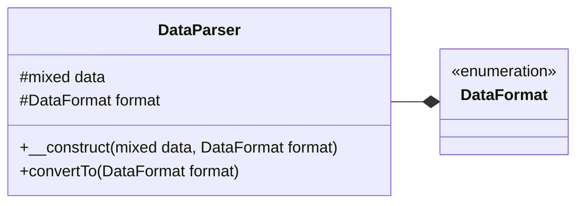

# Structure de PHP Data Parser

Dans cette partie nous allons voir en détail la structure de PHP Data Passer, les différentes classes, les différentes classes ainsi que les rélations entre elles.

## Structure

Dans le schéma ci-dessous vous pouvez voir la liste complète de toutes classes, interfaces, enumérations qui constitue PHP Data Parser.

### Diagramme de classes


### Fonctionnement
!!! info "Information"
    Pour des raisons de simplicité nous avons opté comme type de données intermédiaire le type **array** ce qui veut dire que si vous voulez parser, par exemple, du **JSON** en **XML** la données en JSON sera d'abord parser en _array_ puis en XML.

## DataFormatterInterface
**DataFormatterInterface** est l'interface qui sera implémentée sur chaque classe qui se chargera de parser des les données.

### Diagramme UML


Comme vous pouvez le voir sur l'image ci-dessus, notre _interface **DataFormatterInterface**_ contient deux(2) fonctions à savoir :

- **convert(array data)** : qui prend en paramètre un _array_ et retournera la donnée parsée ;
- **toArray(mixed data)** : qui prend en paramètre une donnée et retournera un _array_ ;

### Code source
```php  linenums="1" title="DataFormatterInterface.php"
declare(strict_types=1);

namespace DataParser;

interface DataFormatterInterface {
  
  public function convert(array $data) : mixed;

  public function toArray(mixed $data) : array;
}
```

## DataFormat
**DataFormat** est objet qui contiendra la liste des énumerations pris en charge.

### Diagramme de classe


Dans le diagramme ci-dessus (**DataFormat**), nous avons listé la liste des types de format pris en charge, dont chaque type de données stockera la classe du formateur à utiliser.
Il est possible d'ajouter de nouvelles classes de parsing de données, pour en savoir plus cliquez [ici](/fr/add_parser/)

### Code source
```php  linenums="1" title="DataFormat.php"
declare(strict_types=1);

namespace DataParser;

use \DataParser\DataFormatters\{
  ArrayFormatter,
  JsonFormatter,
  DtoFormatter,
  XmlFormatter
};

enum DataFormat: string {
  case ARRAY_FORMAT = ArrayFormatter::class;
  case JSON_FORMAT = JsonFormatter::class;
  case DTO_FORMAT = DtoFormatter::class;
  case XML_FORMAT = XmlFormatter::class;
}
```

## Formatters
Dans cette section nous allons voir les **Formatters**, à savoir les classes qui vont s'occuper du parsing des données.

### Diagramme de classe

### Code source : JsonFormatter.php
Nous allons voir de près le code source du parser **JsonFormatter**, ce pas la peine de voir les autres parsers vu qu'ils ressemblent tous pratiquement.

```php linenums="1" title="JsonFormatter.php"
declare(strict_types=1);

namespace DataParser\DataFormatters;

use DataParser\DataFormatterInterface;

class JsonFormatter implements DataFormatterInterface {
  public function convert(array $data) {
    return json_encode($data);
  }
  public function toArray(mixed $data) : array {
    return json_decode($data, true);
  }
}
```

Voyons comment ont été implementée les fonctions **convert** et **toArray** dans la classe _JsonFormatter_ :

- **convert** : ici, nous prenons le tableau passé en paramètre et le passons à la fonction _**json_encode()**_ de PHP qui convertira directement en JSON que nous retournons par la suite ;
 - **toArray** : ici, nous retournons le résultat de la fonction _**json_decode()**_ de PHP qui prendra comme premier argument la données passée en paramètre à et en définissant le second paramètre à _**true**_ sans quoi la donnée rétrounée sera de type _**stdClass**_ ;

## DataParser

Et enfin, ici nous verrons **DataParser**, la classe qui se chargera de charger et de faire fonctionner toutes les autres classes de la librairie.

### Diagramme de classe

Dans le diagramme ci-dessus, la classe _**DataParser**_ est liée à l'énumeartion _**DataFormat**_ par une rélation de _composition_. La classe possède aussi un attribut _**data**_ qui sera chargé de stocker la donnée à parser.

### Code source

```php linenums="1" title="JsonFormatter.php"
declare(strict_types=1);

namespace DataParser;

class DataParser {
  protected mixed $data;

  protected DataFormat $format;
  
  public function __construct(mixed $data, DataFormat $format) {
    $this->data = $data;
    $this->format = $format;
  }
  public function convertTo(DataFormat $format) {
    $data = $this->data;
    $from = $this->format->value;
    $to = $format->value;

    $data_formated = (new $from)->toArray($data);

    return (new $to)->convert($data_formated);
  }
}
```

Commentons le code source ci-dessus:

- **__construct** : le constructeur qui se chargera de créer une instance de la classe et d'initialiser les attributs (respectivement la donnée à parser et le type de la donnée passée en paramètre) ;
- **convertTo** : prend en paramètre le parseur à utiliser pour le format de sortie.
    1. Sur la ligne **19**, nous instancions la classe du parseur passer au constructeur et formatons la données en _array_
    1. sur la ligne **21**, nous instancions la classe du parseur définit en sortie et passons à la fonction _**convert**_ la donnée formatée sur à la ligne **19** que nous allons ensuite retourné.