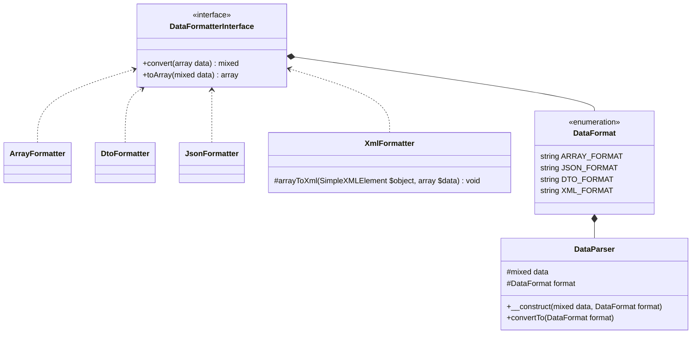
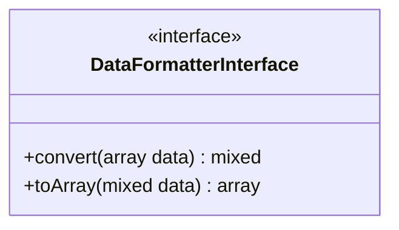
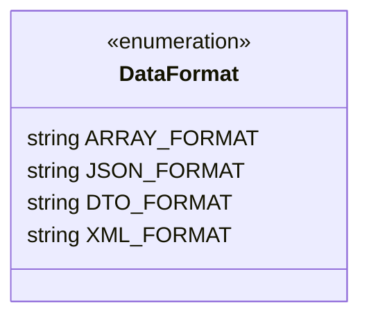
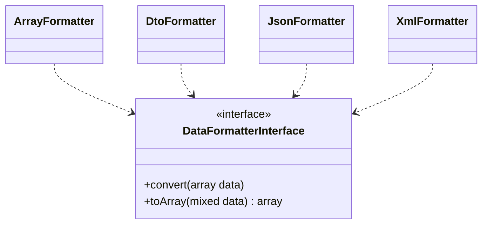
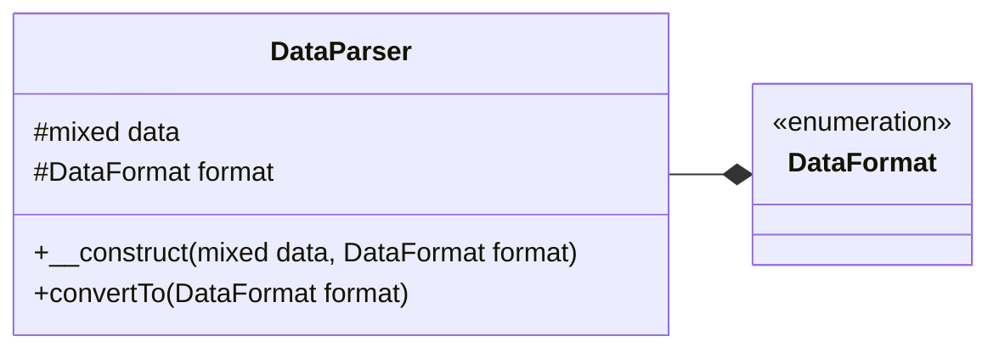

# Структура парсера данных PHP

В этой части мы подробно рассмотрим структуру PHP Data Passer, различные классы, различные классы и связи между ними.

## Структура

На диаграмме ниже вы можете увидеть полный список всех классов, интерфейсов, перечислений, которые составляют PHP Data Parser.

### Диаграмма классов



### Как работает

!!! info "Информация"
    Для простоты мы выбрали **массив** в качестве промежуточного типа данных, что означает, что если вы хотите разобрать, например, **JSON** в **XML**, то данные JSON будут сначала разобраны в _массив_, а затем в XML.

## DataFormatterInterface

**DataFormatterInterface** - это интерфейс, который будет реализован в каждом классе, отвечающем за разбор данных.

### UML диаграмма



Как видно из изображения выше, наш _интерфейс **DataFormatterInterface**_ содержит две (2) функции, а именно:

- **Convert(array data)**: принимает _массив_ в качестве параметра и возвращает разобранные данные;
- **toArray(mixed data)** : который принимает в качестве параметра данные и возвращает _массив_ ;

### Исходный код

```php  linenums="1" title="DataFormatterInterface.php"
declare(strict_types=1);

namespace DataParser;

interface DataFormatterInterface {
  
  public function convert(array $data) : mixed;

  public function toArray(mixed $data) : array;
}
```

## DataFormat

**DataFormat** - это объект, который будет содержать список поддерживаемых перечислений.

### Диаграмма класса



На диаграмме выше (**DataFormat**) мы перечислили поддерживаемые типы форматов, каждый из которых будет хранить класс форматера, который будет использоваться.
Можно добавлять новые классы разбора данных, чтобы узнать больше, нажмите [здесь](/ru/add_parser/)

### Исходный код

```php  linenums="1" title="DataFormat.php"
declare(strict_types=1);

namespace DataParser;

use \DataParser\DataFormatters\{
  ArrayFormatter,
  JsonFormatter,
  DtoFormatter,
  XmlFormatter
};

enum DataFormat: string {
  case ARRAY_FORMAT = ArrayFormatter::class;
  case JSON_FORMAT = JsonFormatter::class;
  case DTO_FORMAT = DtoFormatter::class;
  case XML_FORMAT = XmlFormatter::class;
}
```

## Formatters

В этом разделе мы рассмотрим **Форматоры**, классы, которые будут заниматься разбором данных.

### Диаграмма классов


### Исходный код : JsonFormatter.php

Мы подробно рассмотрим исходный код парсера **JsonFormatter**, нет необходимости рассматривать другие парсеры, поскольку все они выглядят практически одинаково.

```php linenums="1" title="JsonFormatter.php"
declare(strict_types=1);

namespace DataParser\DataFormatters;

use DataParser\DataFormatterInterface;

class JsonFormatter implements DataFormatterInterface {
  public function convert(array $data) {
    return json_encode($data);
  }
  public function toArray(mixed $data) : array {
    return json_decode($data, true);
  }
}
```

Давайте посмотрим, как функции **convert** и **toArray** были реализованы в классе _JsonFormatter_:

- **convert** : Здесь мы берем массив, переданный в качестве параметра, и передаем его в функцию PHP _**json_encode()**_, которая преобразует его непосредственно в JSON, который мы затем возвращаем;
 - **toArray** : Здесь мы возвращаем результат работы PHP-функции _**json_decode()**_, которая принимает в качестве первого аргумента данные, переданные в качестве параметра to, и устанавливает второй параметр в _**true**_, иначе возвращаемые данные будут иметь тип _**stdClass**_;

## DataParser

И, наконец, здесь мы увидим **DataParser**, класс, который будет загружать и запускать все остальные классы библиотеки.

### Диаграмма класса



На диаграмме выше класс _**DataParser**_ связан с перечислением _**DataFormat**_ отношением _композиция_. Класс также имеет атрибут _**data**_, который будет отвечать за хранение данных, подлежащих разбору.

### Исходный код

Мы подробно рассмотрим исходный код парсера **JsonFormatter**, нет необходимости рассматривать другие парсеры, поскольку все они выглядят практически одинаково.

```php linenums="1" title="JsonFormatter.php"
declare(strict_types=1);

namespace DataParser;

class DataParser {
  protected mixed $data;

  protected DataFormat $format;
  
  public function __construct(mixed $data, DataFormat $format) {
    $this->data = $data;
    $this->format = $format;
  }
  public function convertTo(DataFormat $format) {
    $data = $this->data;
    $from = $this->format->value;
    $to = $format->value;

    $data_formated = (new $from)->toArray($data);

    return (new $to)->convert($data_formated);
  }
}
```

Давайте прокомментируем приведенный выше исходный код:

- **__construct**: конструктор, который создаст экземпляр класса и инициализирует атрибуты (соответственно данные для разбора и тип данных, передаваемых в параметре);
- **convertTo** : принимает параметр синтаксического анализатора, который будет использоваться для формата вывода.
    1. В строке **19** мы инстанцируем класс парсера, передаем конструктор и форматируем данные как _массив_;
    1. в строке **21** мы инстанцируем класс парсера, определенный в output, и передаем в функцию _**convert**_ данные, отформатированные в строке **19**, которые мы затем вернем.