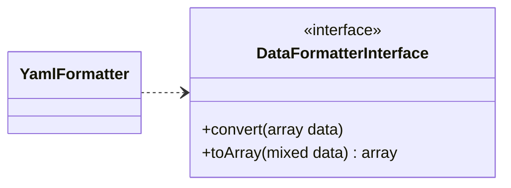

# Добавление парсера

В этой части мы рассмотрим, как создать парсер, который мы добавим к списку уже имеющихся парсеров. И мы создадим парсер, который будет отвечать за разбор **YAML**.

!!! info "Информация"
    Для того чтобы следовать этому разделу, мы рекомендуем вам ознакомиться со [структурой](/ru/structure/) библиотеки, если вы этого еще не сделали.

## Шаг 1: Создание класса

### Диаграмма класса



Как вы можете видеть выше, все синтаксические анализаторы должны реализовывать интерфейс DataFormatterInterface! Поэтому нам придется реализовать оба метода интерфейса.

### Основная структура

Создадим файл _**YamlFormatter.php**_, который сохраним в папке _(расположение_проекта)/DataParser/DataFormatters/_. Этот файл будет содержать исходный код нашего нового парсера.<br/>
А здесь, ниже, представлен минимальный код нашего парсера _YAML_.


```php linenums="1" title="YamlFormatter.php (минимальный код)"
declare(strict_types=1);

namespace DataParser\DataFormatters;

use DataParser\DataFormatterInterface;

class YamlFormatter implements DataFormatterInterface {
  public function convert(array $data) : mixed {
    return '';
  }
  public function toArray(mixed $data) : array {
    return [];
  }
}
```

### Внедрение методов

Для разбора данных в _массив_ в PHP есть функция _**yaml_parse()**_. Мы будем использовать этот метод в нашем методе _**toArray()**_, передавая ему данные для разбора и извлекая результат.

```php linenums="1" title="toArray()"
public function toArray(mixed $data) : array {
  return yaml_parse($data);
}
```

А чтобы разобрать данные из _array_ в формат _yaml_, в PHP есть функция _**yaml_emit()**_. Поэтому мы будем использовать этот метод в нашем методе _**convert()**_, передав ему _массив_ для разбора, и извлечем результат.

```php linenums="1" title="convert()"
public function convert(array $data) : mixed {
  return yaml_emit($data);
}
```

И вот финальный класс:

```php linenums="1" title="YamlFormatter.php (финальный код)"
declare(strict_types=1);

namespace DataParser\DataFormatters;

use DataParser\DataFormatterInterface;

class YamlFormatter implements DataFormatterInterface {
  public function convert(array $data) : mixed {
    return yaml_emit($data);
  }
  public function toArray(mixed $data) : array {
    return yaml_parse($data);
  }
}
```

## Шаг 2: Настройка класса

В этом разделе мы рассмотрим, как добавить класс, который мы создали выше, чтобы его можно было использовать.<br/>
Для этого нет ничего проще, в папке _(место_проекта)/DataParser_ мы добавим наш класс в качестве парсера в файл _**DataFormat.php**_, как показано в исходном коде ниже:

```php linenums="1" title="YamlFormatter.php (финальный код)"
declare(strict_types=1);

namespace DataParser;

use \DataParser\DataFormatters\{
  ArrayFormatter,
  JsonFormatter,
  DtoFormatter,
  XmlFormatter,
  YamlFormatter // namesapce de notre parseur
};

enum DataFormat: string {
  case ARRAY_FORMAT = ArrayFormatter::class;
  case JSON_FORMAT = JsonFormatter::class;
  case DTO_FORMAT = DtoFormatter::class;
  case XML_FORMAT = XmlFormatter::class;
  case YAML_FORMAT = YamlFormatter::class; // le nom de notre classe
}
```

Теперь, когда наш парсер настроен, мы можем перейти к его использованию в следующей главе.

## Использование

Чтобы проверить правильность работы нашего парсера, попробуем разобрать _массив_ в _YAML_. Давайте напишем следующий код:

```php linenums="1" title="YamlFormatter.php (минимальный код)"
// autoloading...

$data = [
  "given" => "Chris",
  "family"=> "Dumars",
  "address"=> [
    "lines"=> "458 Walkman Dr. Suite #292",
    "city"=> "Royal Oak",
    "state"=> "MI",
    "postal"=> 48046,
  ],
];

$parser = new DataParser($data, DataFormat::ARRAY_FORMAT);
$result = $parser->convertTo(DataFormat::YAML_FORMAT);

print_r($result);
```

И вот результат:

```yml
given: "Chris"
  family: "Dumars"
  address:
    lines: "458 Walkman Dr. Suite #292"
    city: "Royal Oak"
    state: "MI"
    postal: 48046
```

Если все шаги были выполнены правильно, вы должны получить результат, аналогичный приведенному выше.

## Заключение

Теперь вы знаете, как добавить парсер в библиотеку PHP Data Parser.