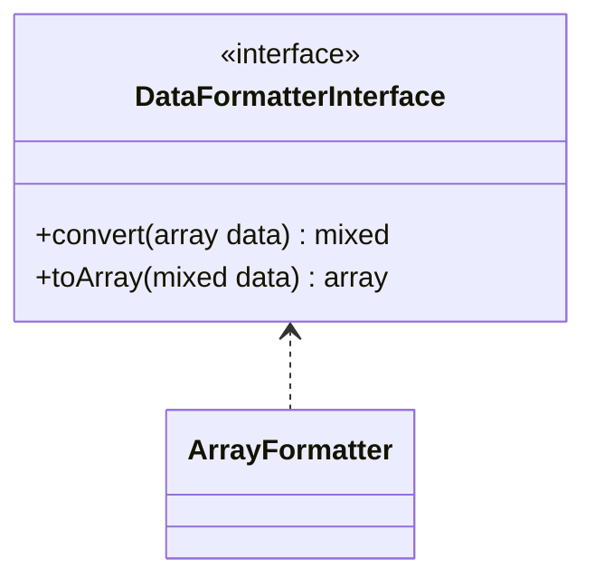

# ArrayFormatter

## Diagramme UML



## Code source

```php  linenums="1" title="ArrayFormatter.php"
declare(strict_types=1);

namespace DataParser\DataFormatters;

use DataParser\DataFormatterInterface;

class ArrayFormatter implements DataFormatterInterface {
	/**
	 * Retrun de the same array passed in parameter
	 * @param  array  $data [description]
	 * @return mixed
	 */
	public function convert(array $data) : mixed {
		return $this->toArray($data);
	}
	/**
	 * Retrun de the same array passed in parameter
	 * @param  mixed  $data
	 * @return array
	 */
	public function toArray(mixed $data) : array {
		return $data;
	}
}
```