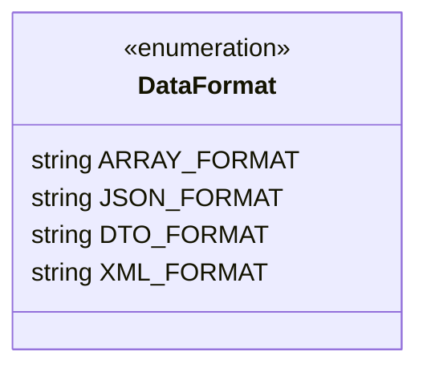

# DataFormat

## Diagramme UML



## Code source

```php  linenums="1" title="DataFormat.php"
declare(strict_types=1);

namespace DataParser;

use \DataParser\DataFormatters\{
	ArrayFormatter,
	JsonFormatter,
	DtoFormatter,
	XmlFormatter
};

enum DataFormat: string {
	case ARRAY_FORMAT = ArrayFormatter::class;
	case JSON_FORMAT = JsonFormatter::class;
	case DTO_FORMAT = DtoFormatter::class;
	case XML_FORMAT = XmlFormatter::class;
}
```