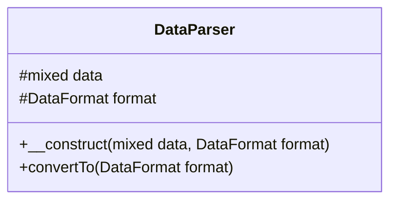

# DataParser

## UML Diagram



## Source code

```php  linenums="1" title="DataParser.php"
declare(strict_types=1);

namespace DataParser;

class DataParser {
	/**
	 * Data to parse
	 * @var mixed $data
	 */
	protected mixed $data;

	/**
	 * Format type of $data
	 * @var DataFormat $format
	 */
	protected DataFormat $format;
	
	/**
	 * Contructor
	 * @param mixed $data : data to convert
	 * @param DataFormat : Format type of $data
	 */
	public function __construct(mixed $data, DataFormat $format) {
		$this->data = $data;
		$this->format = $format;
	}
	/**
	 * The function returns the parsed data according to the output format passed in parameter
	 * @param  DataFormat $format
	 * @return mixed
	 */
	public function convertTo(DataFormat $format) : mixed {
		$data_formated = (new $this->format->value)->toArray($this->data);

		return (new $format->value)->convert($data_formated);
	}
}
```