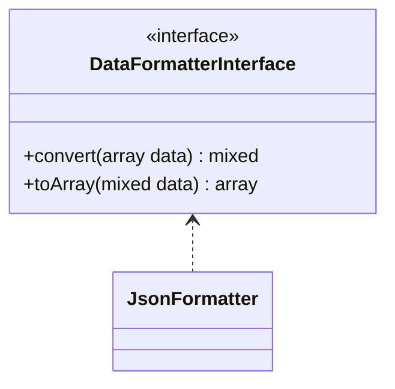

# JsonFormatter

## UML диаграмма



## Исходный код

```php  linenums="1" title="JsonFormatter.php"
declare(strict_types=1);

namespace DataParser\DataFormatters;

use DataParser\DataFormatterInterface;

class JsonFormatter implements DataFormatterInterface {
	/**
	 * Parse data from array to JSON
	 * @param  array  $data
	 * @return mixed
	 */
	public function convert(array $data) : mixed {
		return json_encode($data);
	}

	/**
	 * Parse data from JSON to array
	 * @param  mixed $data
	 * @return array
	 */
	public function toArray(mixed $data) : array {
		return json_decode($data, true);
	}
}
```