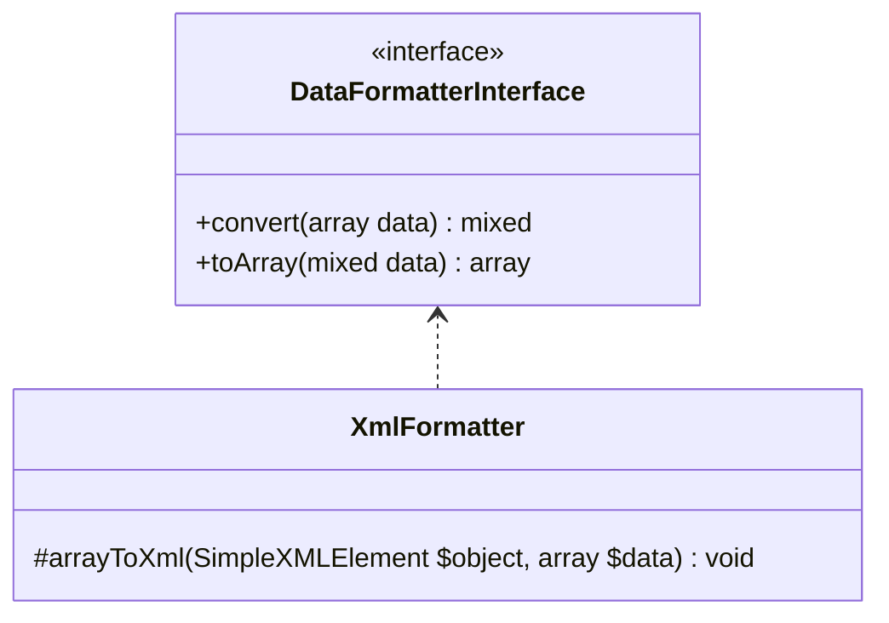

# XmlFormatter

## Diagramme UML



## Code source

```php  linenums="1" title="XmlFormatter.php"
declare(strict_types=1);

namespace DataParser\DataFormatters;

use DataParser\DataFormatterInterface;

class XmlFormatter implements DataFormatterInterface {
	/**
	 * Return parsed data from array to XML by using arrayToXml()
	 * @param  array  $data
	 * @return mixed
	 */
	public function convert(array $data) : mixed {
		$xml = new \SimpleXMLElement('<?xml version="1.0" encoding="UTF-8"?><root/>');
		$this->arrayToXml($xml, $data);
		
		return $xml->asXML();
	}
	/**
	 * Convert data from XML to array
	 * @param  mixed $data
	 * @return array
	 */
	public function toArray(mixed $data) : array {
		$xml = simplexml_load_string($data, "SimpleXMLElement", LIBXML_NOCDATA);
		$json = json_encode($xml);
		$array = json_decode($json,TRUE);
		return $array;
	}
	/**
	 * Parse an array to XML
	 * @param  \SimpleXMLElement $object
	 * @param  array $data
	 * @return void
	 */
	protected function arrayToXml(\SimpleXMLElement $object, array $data) : void{
		foreach ($data as $key => $value) {
			$tag = (is_string($key)) ? $key : 'element';
			if (is_array($value)) {
				$new_object = $object->addChild($tag);
				$this->arrayToXml($new_object, $value);
			} else {
				$object->addChild($tag, strval($value));
			}
		}
	}
}
```