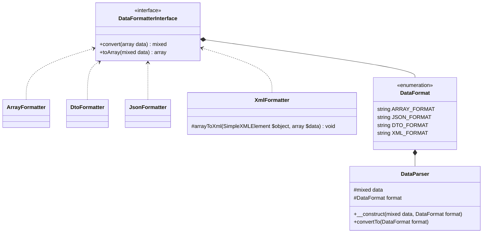
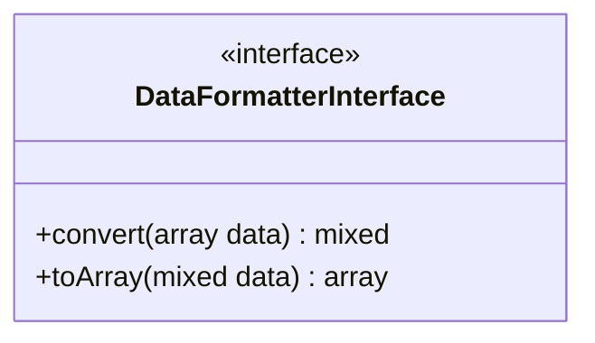
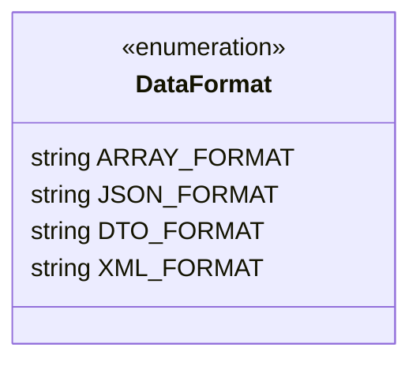
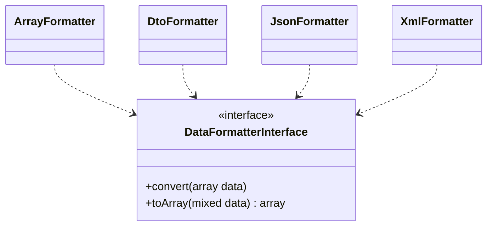
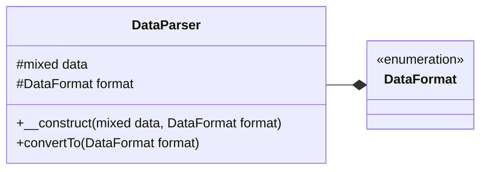

# Structure of PHP Data Parser

In this part we will see in detail the structure of PHP Data Passer, the different classes, the different classes and the relationships between them.

## Structure

In the diagram below you can see the complete list of all classes, interfaces, enumerations that constitute PHP Data Parser.

### Class diagram



### How it works
!!! info "Information"
    For reasons of simplicity we have opted for the intermediate data type **array** which means that if you want to parse, for example, **JSON** into **XML** the JSON data will first be parsed into _array_ then into XML.

## DataFormatterInterface

**DataFormatterInterface** is the interface that will be implemented on each class that will parse the data.

### UML diagram


As you can see on the image above, our _interface **DataFormatterInterface**_ contains two(2) functions namely:

- **convert(array data)** : which takes an _array_ as parameter and will return the parsed data;
- **toArray(mixed data)** : which takes as parameter a data and will return a _array_;

### Source code
```php  linenums="1" title="DataFormatterInterface.php"
declare(strict_types=1);

namespace DataParser;

interface DataFormatterInterface {
  
  public function convert(array $data) : mixed;

  public function toArray(mixed $data) : array;
}
```

## DataFormat

**DataFormat** is an object that will contain the list of supported enumerations.

### Class diagram



In the diagram above (**DataFormat**), we have listed the supported format types, of which each data type will store the formatter class to use.
It is possible to add new data parsing classes, to learn more click [here](/add_parser/)

### Source code
```php  linenums="1" title="DataFormat.php"
declare(strict_types=1);

namespace DataParser;

use \DataParser\DataFormatters\{
  ArrayFormatter,
  JsonFormatter,
  DtoFormatter,
  XmlFormatter
};

enum DataFormat: string {
  case ARRAY_FORMAT = ArrayFormatter::class;
  case JSON_FORMAT = JsonFormatter::class;
  case DTO_FORMAT = DtoFormatter::class;
  case XML_FORMAT = XmlFormatter::class;
}
```

## Formatters

In this section we will see the **Formatters**, i.e. the classes that will take care of the data parsing.

### Class diagram


### Source code : JsonFormatter.php

We'll take a close look at the source code of the **JsonFormatter** parser, there's no need to look at the other parsers as they all look pretty much the same.

```php linenums="1" title="JsonFormatter.php"
declare(strict_types=1);

namespace DataParser\DataFormatters;

use DataParser\DataFormatterInterface;

class JsonFormatter implements DataFormatterInterface {
  public function convert(array $data) {
    return json_encode($data);
  }
  public function toArray(mixed $data) : array {
    return json_decode($data, true);
  }
}
```

Let's see how the **convert** and **toArray** functions have been implemented in the _JsonFormatter_ class:

- **convert** : here, we take the array passed in parameter and pass it to the _**json_encode()**_ function of PHP which will convert directly into JSON that we return afterwards;
 - **toArray** : here, we return the result of the function _**json_decode()**_ of PHP which will take as first argument the data passed in parameter to and by defining the second parameter to _**true**_ without which the returned data will be of type _**stdClass**_ ;

## DataParser

And finally, here we will see **DataParser**, the class that will load and run all the other classes of the library.

### Class diagram



In the above diagram, the _**DataParser**_ class is linked to the _**DataFormat**_ enumeartion by a _composition_ relationship. The class also has an attribute _**data**_ which will be in charge of storing the data to be parsed.

### Source code

```php linenums="1" title="JsonFormatter.php"
declare(strict_types=1);

namespace DataParser;

class DataParser {
  protected mixed $data;

  protected DataFormat $format;
  
  public function __construct(mixed $data, DataFormat $format) {
    $this->data = $data;
    $this->format = $format;
  }
  public function convertTo(DataFormat $format) {
    $data = $this->data;
    $from = $this->format->value;
    $to = $format->value;

    $data_formated = (new $from)->toArray($data);

    return (new $to)->convert($data_formated);
  }
}
```

Let's comment the above source code:

- **__construct** : the constructor which will create an instance of the class and initialize the attributes (respectively the data to be parsed and the type of the data passed in parameter);
- **convertTo** : takes as parameter the parser to use for the output format:
    1. On line **19**, we instantiate the class of the parser pass to the constructor and format the data in _array_
    1. on line **21**, we instantiate the class of the parser defined in output and pass to the function _**convert**_ the formatted data on line **19** that we will then return.